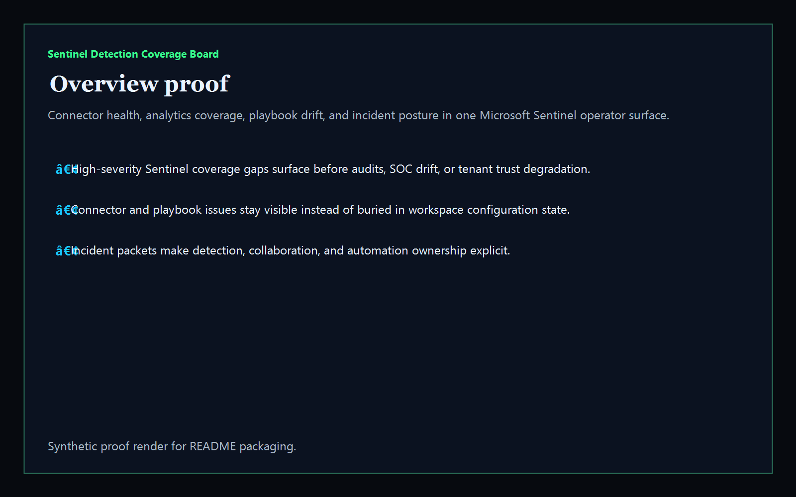
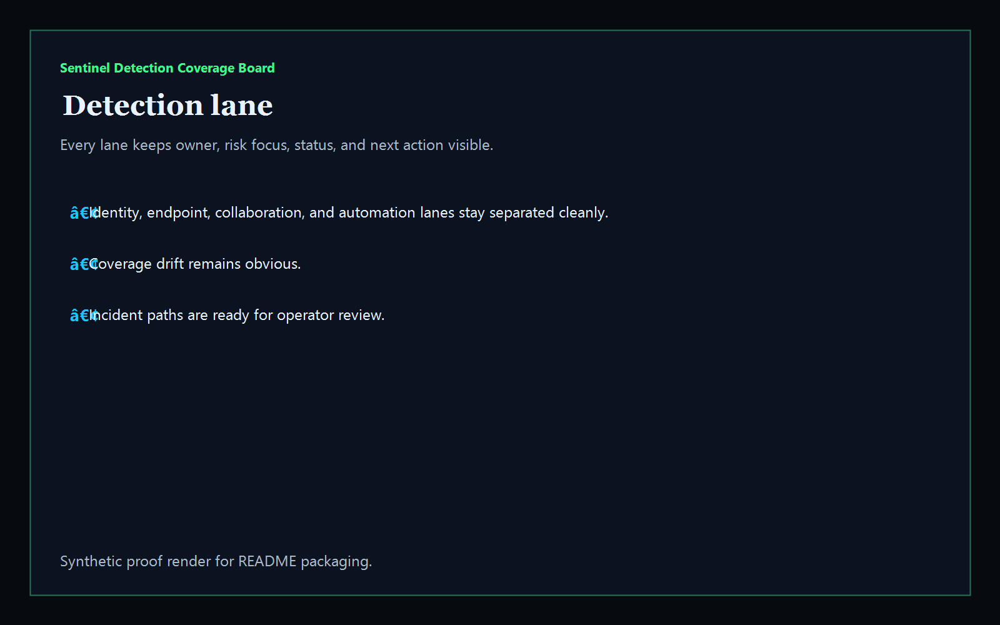
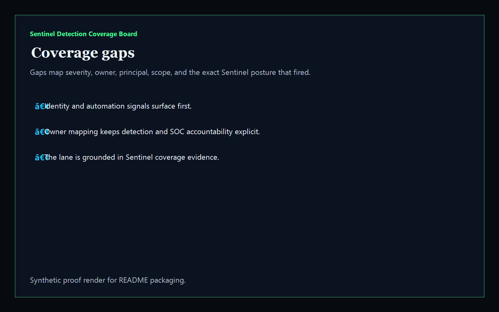
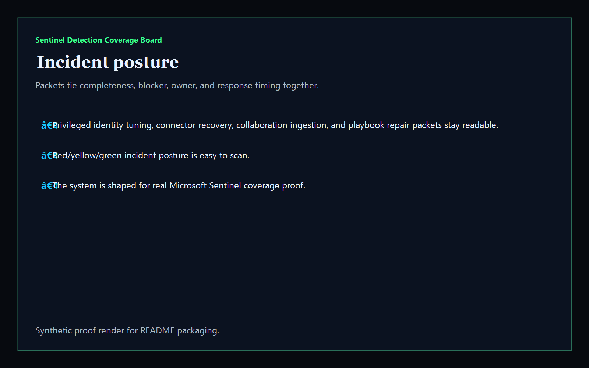

# sentinel-detection-coverage-board

[](https://github.com/mizcausevic-dev/sentinel-detection-coverage-board/actions/workflows/ci.yml)
[](./LICENSE)
[](https://github.com/mizcausevic-dev/sentinel-detection-coverage-board/actions/workflows/pages.yml)

Operator control plane for Microsoft Sentinel workspace health, connector coverage, analytics rules, incident automation drift, and response sequencing.

## Why this exists

- Sentinel workspaces become dangerous when connector drift, disabled rules, and stale incidents stay trapped in raw admin state instead of one operator-readable surface.
- Identity, endpoint, collaboration, and incident automation coverage need to stay visible together before audits, SOC drift, or tenant trust slip.
- Recruiters looking for `Azure / Sentinel / SOC / detection engineering` proof should see a real detection-coverage dashboard, not a keyword page.
- This repo turns Sentinel posture data into a control plane for connector gaps, high-severity detections, stale incidents, and operator packet sequencing.

## Why this matters (KG Embedded tie-back)

This repo demonstrates the Microsoft Sentinel detection-coverage control-plane primitive for cloud and SOC operations: workspace health, detection findings, automation posture, and incident packets in one operator surface. Kinetic Gain Embedded extends this pattern into productized in-app dashboards where SOC, identity, endpoint, and collaboration teams need evidence-rich surfaces without exposing raw admin backends or workspace credentials. See [kineticgain.com/embedded](https://kineticgain.com/embedded).

## What it shows

- `detection-lane` visibility for identity, endpoint, collaboration, and automation coverage in one dashboard
- `coverage-gaps` detection for degraded workspaces, connector gaps, disabled coverage, and stale incident posture
- incident packets for privileged access tuning, connector recovery, collaboration ingestion, and playbook repair
- offline-safe analysis of captured synthetic Sentinel coverage exports
- recruiter-facing Microsoft SOC proof that complements Defender, Entra, Intune, M365 retention, AWS, and GCP lanes

## Routes

- `/`
- `/detection-lane`
- `/coverage-gaps`
- `/incident-posture`
- `/verification`
- `/docs`

## API

- `/api/dashboard/summary`
- `/api/detection-lane`
- `/api/coverage-gaps`
- `/api/incident-posture`
- `/api/verification`
- `/api/sample`

## Screenshots






## CLI

```powershell
npx sentinel-detection-coverage fixtures/sentinel-coverage.json `
    --format json|markdown|summary `
    --now 2026-05-30T00:00:00Z `
    --stale-detection-after-hours 48 `
    --fail-on-high `
    --out report.md
```

Input shape:

```json
{
  "workspaces": [ ... ],
  "detections": [ ... ]
}
```

## Local Development

```powershell
cd sentinel-detection-coverage-board
npm install
npm run dev
```

Open:
- [http://127.0.0.1:5520/](http://127.0.0.1:5520/)
- [http://127.0.0.1:5520/detection-lane](http://127.0.0.1:5520/detection-lane)
- [http://127.0.0.1:5520/coverage-gaps](http://127.0.0.1:5520/coverage-gaps)
- [http://127.0.0.1:5520/incident-posture](http://127.0.0.1:5520/incident-posture)
- [http://127.0.0.1:5520/verification](http://127.0.0.1:5520/verification)

## Validation

- `npm run lint`
- `npm run typecheck`
- `npm run coverage`
- `npm run build`
- `npm run demo`
- `npm run smoke`
- `npm run prerender`
- `npm run render:assets`

## Production status

| Aspect | Status |
|--------|--------|
| CI | Node 20 + 22 matrix — lint · typecheck · coverage · build · demo · smoke · prerender · `npm audit` |
| License | [AGPL-3.0-or-later](./LICENSE) |
| Deploy | Static prerender -> **https://sentinel.kineticgain.com/** |
| Data posture | Synthetic sample data only; no live Sentinel workspace credentials, customer events, or production incidents |
| Suite | Part of the [Kinetic Gain Protocol Suite](https://suite.kineticgain.com/) operator portfolio · apex: [kineticgain.com](https://kineticgain.com) |

## Docs

- [Kinetic Gain Embedded tie-back](./docs/KINETIC_GAIN_EMBEDDED.md)
- [Changelog](./CHANGELOG.md)

## Composes with

- [**`defender-exposure-ops-center`**](https://github.com/mizcausevic-dev/defender-exposure-ops-center) — Defender exposure posture
- [**`entra-access-review-control-plane`**](https://github.com/mizcausevic-dev/entra-access-review-control-plane) — Entra access-review posture
- [**`intune-device-compliance-ops`**](https://github.com/mizcausevic-dev/intune-device-compliance-ops) — Intune device compliance posture

Together they form a broader recruiter-facing Microsoft admin lane: tenant governance, endpoint trust, detection engineering, and SOC coverage proof.
